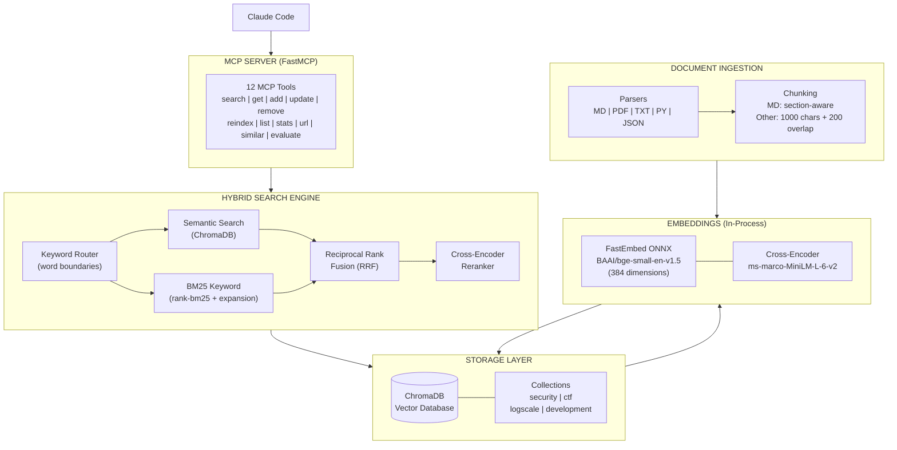
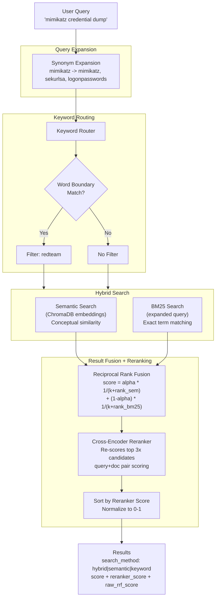
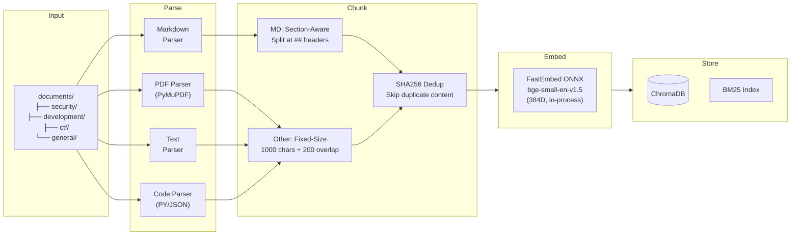
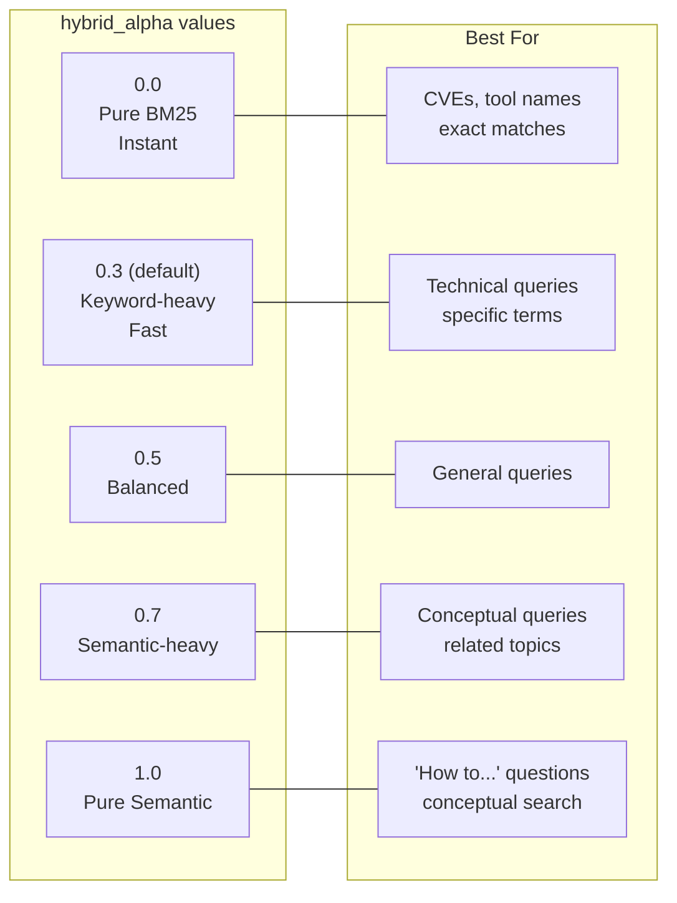

# Knowledge RAG

<div align="center">


[](https://github.com/lyonzin/knowledge-rag/actions/workflows/ci.yml)
[](https://github.com/lyonzin/knowledge-rag/actions/workflows/security.yml)
[](https://glama.ai/mcp/servers/lyonzin/knowledge-rag)
[](https://pypi.org/project/knowledge-rag/)

### LLMs don't know your docs. Every conversation starts from zero.

Your notes, writeups, internal procedures, PDFs — none of it exists to your AI assistant.
Cloud RAG solutions leak your private data. Local ones require Docker, Ollama, and 15 minutes of setup before a single query.

**Knowledge RAG fixes this.** One `pip install`, zero external servers.
Your documents become instantly searchable inside Claude Code — with reranking precision that actually finds what you need.

`clone → pip install → restart Claude Code → done.`

---

**12 MCP Tools** | **Hybrid Search + Cross-Encoder Reranking** | **Markdown-Aware Chunking** | **100% Local, Zero Cloud**

[What's New](#whats-new-in-v330) | [Installation](#installation) | [Configuration](#configuration) | [API Reference](#api-reference) | [Architecture](#architecture)

</div>

---

## Breaking Changes (v2.x → v3.0)

> **v3.0 is a major release.** If you are upgrading from v2.x, read this section first.

| Change | v2.x | v3.0 |
|--------|------|------|
| **Embedding engine** | Ollama (external server) | FastEmbed (ONNX in-process) |
| **Embedding model** | nomic-embed-text (768D) | BAAI/bge-small-en-v1.5 (384D) |
| **Embedding dimensions** | 768 | 384 |
| **Dependencies** | `ollama>=0.6.0` | `fastembed>=0.4.0`, `requests`, `beautifulsoup4` |
| **MCP tools** | 6 tools | 12 tools |
| **Default hybrid_alpha** | 0.3 | 0.3 |

### Migration Steps

```bash
# 1. Pull the latest code
git pull origin main

# 2. Activate your virtual environment
# Windows:
.\venv\Scripts\activate
# Linux/macOS:
source venv/bin/activate

# 3. Install new dependencies
pip install -r requirements.txt

# 4. Restart Claude Code — the server auto-detects dimension mismatch
#    and triggers a nuclear rebuild on first startup (re-embeds everything)
```

The first startup after upgrading will take longer than usual because:
1. FastEmbed downloads the BAAI/bge-small-en-v1.5 model (~50MB, cached in `~/.cache/fastembed/`)
2. All documents are re-embedded with the new 384-dim model
3. The cross-encoder reranker model is downloaded on first query (~25MB)

After the initial rebuild, startup and queries are faster than v2.x because there is no Ollama server dependency.

---

## What's New in v3.3.0

### YAML Configuration System

All settings are now customizable via `config.yaml` — no more editing Python code. Categories, keyword routing, query expansions, models, chunking, and paths are all configurable through a single YAML file.

### Domain Presets

Four ready-to-use presets ship with the project. Copy one to `config.yaml` and you're done:

- **Cybersecurity** — 8 categories, 200+ keywords, 69 query expansions (red team, blue team, CTFs, threat hunting)
- **Developer** — 9 categories, 150+ keywords, 50+ expansions (full-stack, APIs, DevOps, cloud, databases)
- **Research** — 9 categories, 100+ keywords, 40+ expansions (academic papers, thesis, lab notebooks)
- **General** — Zero routing, zero expansions. Pure semantic search for any domain.

### Generic Use Support

With `category_mappings: {}`, `keyword_routes: {}`, and `query_expansions: {}`, the system operates as a domain-agnostic semantic search engine. No security-specific logic unless you want it.

### Backwards Compatible

No `config.yaml`? The system uses built-in defaults — identical behavior to v3.2.x. Zero migration required.

---

## What's New in v3.1.0

### Office Document Support (DOCX, XLSX, PPTX, CSV)

9 formats supported. DOCX headings preserved as markdown structure, Excel sheets extracted as text tables, PowerPoint slides extracted per-slide, CSV natively parsed. All new formats integrate with markdown-aware chunking.

### File Watcher — Auto-Reindex on Changes

Documents directory is monitored in real-time via watchdog. When you add, modify, or delete a file, the system auto-reindexes with 5-second debounce. No manual `reindex_documents` needed.

### MMR Result Diversification

Maximal Marginal Relevance applied after reranking to reduce redundant results. Balances relevance vs diversity (lambda=0.7). If your top 5 results were all from the same document, MMR pushes varied sources up.

---

## What's New in v3.0.0

### Ollama Removed — Zero External Dependencies

FastEmbed replaces Ollama entirely. Embeddings and reranking run in-process via ONNX Runtime. No server to start, no port to check, no process to manage. The embedding model downloads automatically on first run and is cached locally.

### Cross-Encoder Reranking

After hybrid RRF fusion produces initial candidates, a cross-encoder (Xenova/ms-marco-MiniLM-L-6-v2) re-scores query-document pairs jointly. This dramatically improves precision for ambiguous queries where bi-encoder similarity alone is insufficient.

### Markdown-Aware Chunking

`.md` files are now split by `##` and `###` header boundaries instead of fixed 1000-character windows. Each section becomes a semantically coherent chunk. Sections larger than `chunk_size` are sub-chunked with overlap. Non-markdown files still use the standard fixed-size chunker.

### Query Expansion

69 security-term synonym mappings expand abbreviated queries before BM25 search. Searching for "sqli" automatically includes "sql injection"; "privesc" includes "privilege escalation"; "pth" includes "pass-the-hash". Customize or replace these in `config.yaml` (see [Configuration](#configuration)).

### 6 New MCP Tools (12 Total)

| Tool | Description |
|------|-------------|
| `add_document` | Add a document from raw content string |
| `update_document` | Update an existing document (re-chunks and re-indexes) |
| `remove_document` | Remove a document from the index (optionally delete file) |
| `add_from_url` | Fetch a URL, strip HTML, convert to markdown, and index |
| `search_similar` | Find documents similar to a given document by embedding |
| `evaluate_retrieval` | Evaluate retrieval quality with test cases (MRR@5, Recall@5) |

### Auto-Migration

On startup, the server detects if stored embeddings have a different dimension than the configured model (768 vs 384). If mismatch is found, a nuclear rebuild runs automatically — no manual intervention required.

---

## Overview

Knowledge RAG is a **100% local** hybrid search system that integrates with Claude Code via MCP (Model Context Protocol). It enables Claude to search through your documents (Markdown, PDFs, code, text) and retrieve relevant context using a combination of semantic embeddings, BM25 keyword matching, and cross-encoder reranking.

### Why Knowledge RAG?

- **Zero External Dependencies**: Everything runs in-process. No Ollama, no API keys, no servers to manage.
- **Hybrid Search + Reranking**: Semantic embeddings + BM25 keywords fused with RRF, then reranked by a cross-encoder for maximum precision.
- **Markdown-Aware**: `.md` files are chunked by section headers, preserving semantic coherence.
- **Query Expansion**: Customizable synonym mappings ensure abbreviated queries find relevant content (69 security terms included as preset).
- **Privacy First**: All processing happens locally. No data leaves your machine.
- **Multi-Format**: Supports MD, PDF, DOCX, XLSX, PPTX, CSV, TXT, Python, JSON files.
- **Smart Routing**: Keyword-based routing with word boundaries for accurate category filtering.
- **Incremental Indexing**: Only re-indexes new or modified files. Instant startup for unchanged knowledge bases.
- **CRUD via MCP**: Add, update, remove documents directly from Claude Code. Fetch URLs and index them.

---

## Features

| Feature | Description |
|---------|-------------|
| **Hybrid Search** | Semantic + BM25 keyword search with Reciprocal Rank Fusion |
| **Cross-Encoder Reranker** | Xenova/ms-marco-MiniLM-L-6-v2 re-scores top candidates for precision |
| **YAML Configuration** | Fully customizable via `config.yaml` with domain-specific presets |
| **Query Expansion** | 69 security-term synonym mappings (sqli, privesc, pth, etc.) — customizable |
| **Markdown-Aware Chunking** | `.md` files split by `##`/`###` sections instead of fixed windows |
| **In-Process Embeddings** | FastEmbed ONNX Runtime (BAAI/bge-small-en-v1.5, 384D) |
| **Keyword Routing** | Word-boundary aware routing for domain-specific queries |
| **Multi-Format Parser** | PDF, DOCX, XLSX, PPTX, CSV, Markdown, TXT, Python, JSON (9 formats) |
| **Category Organization** | Organize docs by security, development, ctf, logscale, etc. |
| **Incremental Indexing** | Change detection via mtime/size. Only re-indexes modified files. |
| **Chunk Deduplication** | SHA256 content hashing prevents duplicate chunks |
| **Query Cache** | LRU cache with 5-min TTL for instant repeat queries |
| **Document CRUD** | Add, update, remove documents via MCP tools |
| **URL Ingestion** | Fetch URLs, strip HTML, convert to markdown, index |
| **Similarity Search** | Find documents similar to a reference document |
| **Retrieval Evaluation** | Built-in MRR@5 and Recall@5 metrics |
| **File Watcher** | Auto-reindex on document changes via watchdog (5s debounce) |
| **MMR Diversification** | Maximal Marginal Relevance reduces redundant results |
| **Auto-Migration** | Detects embedding dimension mismatch and rebuilds automatically |
| **Persistent Storage** | ChromaDB with DuckDB backend |
| **12 MCP Tools** | Full CRUD + search + evaluation via Claude Code |

---

## Architecture

### System Overview



### Query Processing Flow



### Document Ingestion Flow



### hybrid_alpha Parameter Effect



---

## Installation

### Prerequisites

- Python 3.11 or 3.12 (**NOT** 3.13+ due to onnxruntime compatibility)
- Claude Code CLI
- ~200MB disk for model cache (auto-downloaded on first run)

> **Note:** Ollama is no longer required. FastEmbed downloads models automatically.

### Quick Start (3 steps)

**Step 1: Clone and install**

```bash
# Clone to your home directory
git clone https://github.com/lyonzin/knowledge-rag.git ~/knowledge-rag
cd ~/knowledge-rag

# Create virtual environment and install
python3 -m venv venv
source venv/bin/activate        # Linux/macOS
# .\venv\Scripts\activate       # Windows
pip install -r requirements.txt
```

> **Windows users**: `~/knowledge-rag` becomes `C:\Users\YourName\knowledge-rag`. Use `python` instead of `python3`.

**Step 2: Configure Claude Code**

From inside the cloned folder, run:

```bash
cd ~/knowledge-rag
claude mcp add knowledge-rag -s user -- ~/knowledge-rag/venv/bin/python -m mcp_server.server
```

> **Windows**: `claude mcp add knowledge-rag -s user -- cmd /c "cd /d %USERPROFILE%\knowledge-rag && venv\Scripts\python -m mcp_server.server"`

That's it. Claude Code now knows about your RAG server.

<details>
<summary>Alternative: manual JSON config</summary>

Add to `~/.claude.json`:

**Windows:**
```json
{
  "mcpServers": {
    "knowledge-rag": {
      "type": "stdio",
      "command": "cmd",
      "args": ["/c", "cd /d %USERPROFILE%\\knowledge-rag && python -m mcp_server.server"],
      "env": {}
    }
  }
}
```

**Linux / macOS:**
```json
{
  "mcpServers": {
    "knowledge-rag": {
      "type": "stdio",
      "command": "/home/YOUR_USER/knowledge-rag/venv/bin/python",
      "args": ["-m", "mcp_server.server"],
      "cwd": "/home/YOUR_USER/knowledge-rag",
      "env": {}
    }
  }
}
```
> Replace `YOUR_USER` with your username, or use the full path from `echo $HOME`.
</details>

**Step 3: Restart Claude Code**

```bash
# Verify the server is connected
claude mcp list
```

On first start, the server will:
1. Download the embedding model (~50MB, cached in `~/.cache/fastembed/`)
2. Auto-index any documents in the `documents/` directory
3. Start watching for file changes (auto-reindex)

---

## Usage

### Adding Documents

Place your documents in the `documents/` directory, organized by category:

```
documents/
├── security/          # Pentest, exploit, vulnerability docs
├── development/       # Code, APIs, frameworks
├── ctf/               # CTF writeups and methodology
├── logscale/          # LogScale/LQL documentation
└── general/           # Everything else
```

Or add documents programmatically via MCP tools:

```python
# Add from content
add_document(
    content="# My Document\n\nContent here...",
    filepath="security/my-technique.md",
    category="security"
)

# Add from URL
add_from_url(
    url="https://example.com/article",
    category="security",
    title="Custom Title"
)
```

### Searching

Claude uses the RAG system automatically when configured. You can also control search behavior:

```python
# Pure keyword search — instant, no embedding needed
search_knowledge("gtfobins suid", hybrid_alpha=0.0)

# Keyword-heavy (default) — fast, slight semantic boost
search_knowledge("mimikatz", hybrid_alpha=0.3)

# Balanced hybrid — both engines equally weighted
search_knowledge("SQL injection techniques", hybrid_alpha=0.5)

# Semantic-heavy — better for conceptual queries
search_knowledge("how to escalate privileges", hybrid_alpha=0.7)

# Pure semantic — embedding similarity only
search_knowledge("lateral movement strategies", hybrid_alpha=1.0)
```

### Indexing

Documents are automatically indexed on first startup. To manage the index:

```python
# Incremental: only re-index changed files (fast)
reindex_documents()

# Smart reindex: detect changes + rebuild BM25
reindex_documents(force=True)

# Nuclear rebuild: delete everything, re-embed all (use after model change)
reindex_documents(full_rebuild=True)
```

### Evaluating Retrieval Quality

```python
evaluate_retrieval(test_cases='[
    {"query": "sql injection", "expected_filepath": "security/sqli-guide.md"},
    {"query": "privilege escalation", "expected_filepath": "security/privesc.md"}
]')
# Returns: MRR@5, Recall@5, per-query results
```

---

## API Reference

### Search & Query

#### `search_knowledge`

Hybrid search combining semantic search + BM25 keyword search with cross-encoder reranking.

| Parameter | Type | Default | Description |
|-----------|------|---------|-------------|
| `query` | string | required | Search query text (1-3 keywords recommended) |
| `max_results` | int | 5 | Maximum results to return (1-20) |
| `category` | string | null | Filter by category (security, ctf, logscale, development, general, redteam, blueteam) |
| `hybrid_alpha` | float | 0.3 | Balance: 0.0 = keyword only, 1.0 = semantic only |

**Returns:**

```json
{
  "status": "success",
  "query": "mimikatz credential dump",
  "hybrid_alpha": 0.5,
  "result_count": 3,
  "cache_hit_rate": "0.0%",
  "results": [
    {
      "content": "Mimikatz can extract credentials from memory...",
      "source": "documents/security/credential-attacks.md",
      "filename": "credential-attacks.md",
      "category": "security",
      "score": 0.9823,
      "raw_rrf_score": 0.016393,
      "reranker_score": 0.987654,
      "semantic_rank": 2,
      "bm25_rank": 1,
      "search_method": "hybrid",
      "keywords": ["mimikatz", "credential", "lsass"],
      "routed_by": "redteam"
    }
  ]
}
```

**Search Method Values:**
- `hybrid`: Found by both semantic and BM25 search (highest confidence)
- `semantic`: Found only by semantic search
- `keyword`: Found only by BM25 keyword search

---

#### `get_document`

Retrieve the full content of a specific document.

| Parameter | Type | Description |
|-----------|------|-------------|
| `filepath` | string | Path to the document file |

**Returns:** JSON with document content, metadata, keywords, and chunk count.

---

#### `reindex_documents`

Index or reindex all documents in the knowledge base.

| Parameter | Type | Default | Description |
|-----------|------|---------|-------------|
| `force` | bool | false | Smart reindex: detects changes, rebuilds BM25. Fast. |
| `full_rebuild` | bool | false | Nuclear rebuild: deletes everything, re-embeds all documents. Use after model change. |

**Returns:** JSON with indexing statistics (indexed, updated, skipped, deleted, chunks_added, chunks_removed, dedup_skipped, elapsed_seconds).

---

#### `list_categories`

List all document categories with their document counts.

**Returns:**

```json
{
  "status": "success",
  "categories": {
    "security": 52,
    "development": 8,
    "ctf": 12,
    "general": 3
  },
  "total_documents": 75
}
```

---

#### `list_documents`

List all indexed documents, optionally filtered by category.

| Parameter | Type | Description |
|-----------|------|-------------|
| `category` | string | Optional category filter |

**Returns:** JSON array of documents with id, source, category, format, chunks, and keywords.

---

#### `get_index_stats`

Get statistics about the knowledge base index.

**Returns:**

```json
{
  "status": "success",
  "stats": {
    "total_documents": 75,
    "total_chunks": 9256,
    "unique_content_hashes": 9100,
    "categories": {"security": 52, "development": 8},
    "supported_formats": [".md", ".txt", ".pdf", ".py", ".json"],
    "embedding_model": "BAAI/bge-small-en-v1.5",
    "embedding_dim": 384,
    "reranker_model": "Xenova/ms-marco-MiniLM-L-6-v2",
    "chunk_size": 1000,
    "chunk_overlap": 200,
    "query_cache": {
      "size": 12,
      "max_size": 100,
      "ttl_seconds": 300,
      "hits": 45,
      "misses": 23,
      "hit_rate": "66.2%"
    }
  }
}
```

---

### Document Management

#### `add_document`

Add a new document to the knowledge base from raw content. Saves the file to the documents directory and indexes it immediately.

| Parameter | Type | Default | Description |
|-----------|------|---------|-------------|
| `content` | string | required | Full text content of the document |
| `filepath` | string | required | Relative path within documents dir (e.g., `security/new-technique.md`) |
| `category` | string | "general" | Document category |

**Returns:**

```json
{
  "status": "success",
  "chunks_added": 5,
  "dedup_skipped": 0,
  "category": "security",
  "filepath": "/path/to/knowledge-rag/documents/security/new-technique.md"
}
```

---

#### `update_document`

Update an existing document. Removes old chunks from the index and re-indexes with new content.

| Parameter | Type | Description |
|-----------|------|-------------|
| `filepath` | string | Full path to the document file |
| `content` | string | New content for the document |

**Returns:**

```json
{
  "status": "success",
  "old_chunks_removed": 5,
  "new_chunks_added": 7,
  "dedup_skipped": 0,
  "filepath": "/path/to/document.md"
}
```

---

#### `remove_document`

Remove a document from the knowledge base index. Optionally deletes the file from disk.

| Parameter | Type | Default | Description |
|-----------|------|---------|-------------|
| `filepath` | string | required | Path to the document file |
| `delete_file` | bool | false | If true, also delete the file from disk |

**Returns:**

```json
{
  "status": "success",
  "chunks_removed": 5,
  "filepath": "/path/to/document.md",
  "file_deleted": false
}
```

---

#### `add_from_url`

Fetch content from a URL, strip HTML (scripts, styles, nav, footer, header), convert to markdown, and add to the knowledge base.

| Parameter | Type | Default | Description |
|-----------|------|---------|-------------|
| `url` | string | required | URL to fetch content from |
| `category` | string | "general" | Document category |
| `title` | string | null | Custom title (auto-detected from `<title>` tag if not provided) |

**Returns:** Same as `add_document`.

---

#### `search_similar`

Find documents similar to a given document using embedding similarity. Returns unique documents (deduplicates by source path, excludes the reference document itself).

| Parameter | Type | Default | Description |
|-----------|------|---------|-------------|
| `filepath` | string | required | Path to the reference document |
| `max_results` | int | 5 | Number of similar documents to return (1-20) |

**Returns:**

```json
{
  "status": "success",
  "reference": "/path/to/reference.md",
  "count": 3,
  "similar_documents": [
    {
      "source": "/path/to/similar-doc.md",
      "filename": "similar-doc.md",
      "category": "security",
      "similarity": 0.8742,
      "preview": "First 200 characters of the similar document..."
    }
  ]
}
```

---

#### `evaluate_retrieval`

Evaluate retrieval quality with test queries. Useful for tuning `hybrid_alpha`, testing query expansion effectiveness, or validating after reindexing.

| Parameter | Type | Description |
|-----------|------|-------------|
| `test_cases` | string (JSON) | Array of test cases: `[{"query": "...", "expected_filepath": "..."}, ...]` |

**Returns:**

```json
{
  "status": "success",
  "total_queries": 3,
  "mrr_at_5": 0.8333,
  "recall_at_5": 1.0,
  "per_query": [
    {
      "query": "sql injection",
      "expected": "security/sqli-guide.md",
      "found_at_rank": 1,
      "reciprocal_rank": 1.0,
      "top_result": "documents/security/sqli-guide.md"
    }
  ]
}
```

**Metrics:**
- **MRR@5** (Mean Reciprocal Rank): Average of 1/rank for expected documents. 1.0 = always first result.
- **Recall@5**: Fraction of expected documents found in top 5 results. 1.0 = all found.

---

## Configuration

Knowledge RAG is fully configurable via a `config.yaml` file in the project root. If no `config.yaml` exists, sensible defaults are used — the system works out of the box with zero configuration.

### Quick Start

```bash
# Option 1: Use a preset
cp presets/cybersecurity.yaml config.yaml    # Offensive/defensive security, CTFs
cp presets/developer.yaml config.yaml        # Software engineering, APIs, DevOps
cp presets/research.yaml config.yaml         # Academic research, papers, studies
cp presets/general.yaml config.yaml          # Blank slate, pure semantic search

# Option 2: Start from the documented template
cp config.example.yaml config.yaml
# Edit config.yaml to your needs
```

Restart Claude Code after changing `config.yaml`.

### config.yaml Structure

```yaml
# Paths — where your documents live
paths:
  documents_dir: "./documents"    # Scanned recursively
  data_dir: "./data"              # Index storage

# Documents — what gets indexed and how
documents:
  supported_formats:              # File types to index
    - .md
    - .txt
    - .pdf
    - .docx
    # - .py                       # Uncomment to index code
  chunking:
    chunk_size: 1000              # Max chars per chunk
    chunk_overlap: 200            # Shared chars between chunks

# Models — AI models for search (all run locally, no API keys)
models:
  embedding:
    model: "BAAI/bge-small-en-v1.5"   # ONNX, ~33MB, auto-downloaded
    dimensions: 384
  reranker:
    enabled: true                      # Set false on low-resource machines
    model: "Xenova/ms-marco-MiniLM-L-6-v2"
    top_k_multiplier: 3               # Candidates fetched before reranking

# Search — result limits and collection name
search:
  default_results: 5
  max_results: 20
  collection_name: "knowledge_base"   # Change for separate knowledge bases

# Categories — auto-tag documents by folder path
# Set to {} to disable categorization entirely
category_mappings:
  "security/redteam": "redteam"
  "security/blueteam": "blueteam"
  "notes": "notes"

# Keyword routing — prioritize categories based on query keywords
# Set to {} for pure semantic search with no routing bias
keyword_routes:
  redteam:
    - pentest
    - exploit
    - privilege escalation

# Query expansion — expand abbreviations for better BM25 recall
# Set to {} for no expansion (search terms used as-is)
query_expansions:
  sqli:
    - sql injection
    - sqli
  privesc:
    - privilege escalation
    - privesc
```

> See `config.example.yaml` for the fully documented template with explanations for every field.

### Presets

Pre-built configurations for common use cases. Each preset is a complete `config.yaml` ready to use:

| Preset | File | Categories | Keywords | Expansions | Best For |
|--------|------|-----------|----------|-----------|----------|
| **Cybersecurity** | `presets/cybersecurity.yaml` | 8 | 200+ | 69 | Red/Blue Team, CTFs, threat hunting, exploit dev |
| **Developer** | `presets/developer.yaml` | 9 | 150+ | 50+ | Full-stack dev, APIs, DevOps, cloud, databases |
| **Research** | `presets/research.yaml` | 9 | 100+ | 40+ | Academic papers, thesis, lab notebooks, datasets |
| **General** | `presets/general.yaml` | 0 | 0 | 0 | Blank slate — pure semantic search, no domain logic |

**Creating your own preset**: Copy `config.example.yaml`, fill in your categories/keywords/expansions, save to `presets/your-domain.yaml`. Share it with the community via PR.

### Configuration Reference

#### Paths

| Field | Default | Description |
|-------|---------|-------------|
| `paths.documents_dir` | `./documents` | Root folder scanned recursively for documents |
| `paths.data_dir` | `./data` | Internal storage for ChromaDB and index metadata |

Relative paths resolve from the project root. Absolute paths work too. The `KNOWLEDGE_RAG_DIR` environment variable overrides the project root.

#### Documents

| Field | Default | Description |
|-------|---------|-------------|
| `documents.supported_formats` | .md .txt .pdf .py .json .docx .xlsx .pptx .csv | File extensions to index |
| `documents.chunking.chunk_size` | 1000 | Max characters per chunk |
| `documents.chunking.chunk_overlap` | 200 | Characters shared between consecutive chunks |

**Chunking guidelines**: Short notes → 500/100. General use → 1000/200. Long technical docs → 1500/300.

For `.md` files, chunking splits at `##` and `###` header boundaries first. Sections larger than `chunk_size` are sub-chunked with overlap. Non-markdown files use fixed-size chunking.

#### Models

| Field | Default | Description |
|-------|---------|-------------|
| `models.embedding.model` | `BAAI/bge-small-en-v1.5` | Embedding model (ONNX, runs locally) |
| `models.embedding.dimensions` | 384 | Vector dimensions (must match model) |
| `models.reranker.enabled` | true | Enable cross-encoder reranking |
| `models.reranker.model` | `Xenova/ms-marco-MiniLM-L-6-v2` | Reranker model |
| `models.reranker.top_k_multiplier` | 3 | Fetch N*multiplier candidates for reranking |

**Embedding model options** (fastest → most accurate):
- `BAAI/bge-small-en-v1.5` — 384D, ~33MB (default)
- `BAAI/bge-base-en-v1.5` — 768D, ~130MB
- `BAAI/bge-large-en-v1.5` — 1024D, ~335MB
- `intfloat/multilingual-e5-small` — 384D, 100+ languages

> **Warning**: Changing the embedding model after indexing requires `reindex_documents(full_rebuild=True)`.

The reranker fetches `max_results * top_k_multiplier` candidates from RRF fusion, re-scores them with the cross-encoder, and returns the top `max_results`. Set `enabled: false` to disable and use RRF scores directly.

#### Search

| Field | Default | Description |
|-------|---------|-------------|
| `search.default_results` | 5 | Results returned when no limit specified |
| `search.max_results` | 20 | Hard cap even if client requests more |
| `search.collection_name` | `knowledge_base` | ChromaDB collection — change for separate KBs |

#### Categories

Map folder paths to category names. Documents in matching folders get auto-tagged, enabling filtered searches.

```yaml
# Most specific match wins:
# documents/security/redteam/exploit.md → "redteam"
# documents/security/overview.md → "security"
category_mappings:
  "security/redteam": "redteam"
  "security": "security"
```

Set `category_mappings: {}` to disable — documents are still searchable, just without category filters.

#### Keyword Routing

Route queries to categories based on keywords. When a query contains listed keywords, results from that category are prioritized (not filtered — other categories still appear, ranked lower).

```yaml
keyword_routes:
  redteam:
    - pentest
    - exploit
    - sqli
```

Single-word keywords use regex word boundaries (`\b`) — "api" won't match "RAPID". Multi-word keywords use substring matching. When multiple keywords match, the category with the most matches wins.

Set `keyword_routes: {}` for pure semantic search.

#### Query Expansion

Expand search terms with synonyms before BM25 search. Supports single tokens, bigrams, and full query matches.

```yaml
query_expansions:
  sqli:
    - sql injection
    - sqli
  k8s:
    - kubernetes
    - k8s
```

Set `query_expansions: {}` for no expansion.

### Hybrid Search Tuning

| hybrid_alpha | Behavior | Best For |
|--------------|----------|----------|
| 0.0 | Pure BM25 keyword | Exact terms, CVEs, tool names |
| 0.3 | Keyword-heavy **(default)** | Technical queries with specific terms |
| 0.5 | Balanced | General queries |
| 0.7 | Semantic-heavy | Conceptual queries, related topics |
| 1.0 | Pure semantic | "How to..." questions, abstract concepts |

> All `hybrid_alpha` values have similar speed because FastEmbed runs in-process.

---

## Project Structure

```
knowledge-rag/
├── mcp_server/
│   ├── __init__.py
│   ├── config.py            # YAML config loader + defaults
│   ├── ingestion.py         # Document parsing, chunking, metadata extraction
│   └── server.py            # MCP server, ChromaDB, BM25, reranker, 12 tools
├── config.example.yaml      # Documented config template (copy to config.yaml)
├── config.yaml              # Your active configuration (git-ignored)
├── presets/                  # Ready-to-use domain configurations
│   ├── cybersecurity.yaml   # Red/Blue Team, CTFs, threat hunting
│   ├── developer.yaml       # Software engineering, APIs, DevOps
│   ├── research.yaml        # Academic research, papers, studies
│   └── general.yaml         # Blank slate, zero domain logic
├── documents/               # Your documents (scanned recursively)
├── data/
│   ├── chroma_db/           # ChromaDB vector database
│   └── index_metadata.json  # Incremental indexing state
├── tests/                   # Test suite (55 tests)
├── venv/                    # Python virtual environment
├── requirements.txt         # Python dependencies
├── LICENSE                  # MIT License
└── README.md
```

---

## Troubleshooting

### Python version mismatch

ChromaDB depends on onnxruntime which requires Python 3.11 or 3.12. Python 3.13+ is **NOT** supported.

```bash
# Check version
python --version

# Windows: use specific version
py -3.12 -m venv venv

# Linux/macOS: use specific version
python3.12 -m venv venv
```

### FastEmbed model download fails

On first run, FastEmbed downloads models to `~/.cache/fastembed/`. If the download fails:

```bash
# Check internet connectivity
# Models are downloaded from Hugging Face

# Manual workaround: clear cache and retry
# Windows:
rmdir /s /q %USERPROFILE%\.cache\fastembed

# Linux/macOS:
rm -rf ~/.cache/fastembed

# Then restart the MCP server
```

### Index is empty

```bash
# Check documents directory has files
ls documents/

# Force reindex via Claude Code:
# reindex_documents(force=True)

# Or nuclear rebuild if model changed:
# reindex_documents(full_rebuild=True)
```

### MCP server not loading

1. Check `~/.claude.json` exists and has valid JSON in the `mcpServers` section
2. Verify paths use double backslashes (`\\`) on Windows
3. Restart Claude Code completely
4. Run `claude mcp list` to check connection status

### "ModuleNotFoundError: No module named 'rank_bm25'"

```bash
# Activate your venv first, then:
pip install rank-bm25
```

### "ModuleNotFoundError: No module named 'mcp_server'"

This occurs when Claude Code doesn't set the working directory correctly. Use the `cmd /c "cd /d ... && python"` wrapper in your MCP config (see [Installation](#configure-mcp-for-claude-code)).

### Dimension mismatch after upgrade

This is expected when upgrading from v2.x (768D) to v3.0 (384D). The server detects the mismatch automatically and runs a nuclear rebuild on first startup. No manual action needed. If the auto-rebuild fails:

```bash
# Manual nuclear rebuild
# Delete the ChromaDB data
# Windows:
rmdir /s /q data\chroma_db
del data\index_metadata.json

# Linux/macOS:
rm -rf data/chroma_db
rm data/index_metadata.json

# Then restart the MCP server — it will re-index everything
```

### Slow first query

The cross-encoder reranker model is lazy-loaded on the first query that triggers reranking. This adds a one-time ~2-3 second delay for model download and loading. Subsequent queries are fast.

### Memory usage

With ~200 documents, expect ~300-500MB RAM. The embedding model (~50MB) and reranker (~25MB) are loaded into memory. For very large knowledge bases (1000+ documents), consider increasing the chunk deduplication to reduce index size.

---

## Changelog

### v3.3.0 (2026-04-05)

- **NEW**: YAML configuration system — fully customizable via `config.yaml`
- **NEW**: Domain presets — `presets/cybersecurity.yaml`, `presets/developer.yaml`, `presets/research.yaml`, `presets/general.yaml`
- **NEW**: `config.example.yaml` — documented template with explanations for every field
- **NEW**: Categories, keyword routing, and query expansions are now user-configurable (no more editing `config.py`)
- **NEW**: Empty config = pure semantic search with zero domain logic (ideal for generic use)
- **NEW**: Warning log for empty files during indexing (previously silent skip)
- **IMPROVED**: README rewritten — full configuration reference, preset documentation, updated project structure
- **IMPROVED**: `pyyaml` added as dependency
- **BREAKING**: None — system works identically without `config.yaml` (backwards compatible)

### v3.2.4 (2026-04-03)

- **NEW**: Symlink support — `documents/` directory now follows symbolic links recursively ([#13](https://github.com/lyonzin/knowledge-rag/issues/13))
- **NEW**: Circular symlink loop protection via realpath deduplication
- **IMPROVED**: `_has_documents()` detection now validates against supported formats only (stricter than before)

### v3.2.3 (2026-03-22)

- **FIX**: BASE_DIR smart detection — checks for actual files in `documents/` (not just dir existence)
- **FIX**: Prevents false positive when `site-packages/documents/` exists as empty dir

### v3.2.2 (2026-03-22)

- **FIX**: `pip install knowledge-rag` now works as plug-and-play (BASE_DIR falls back to CWD when installed from PyPI)
- **FIX**: `category="aar"` now accepted by search_knowledge (was rejected by validator)
- **NEW**: `KNOWLEDGE_RAG_DIR` env var for explicit base directory override

### v3.2.1 (2026-03-22)

- **FIX**: Auto-recovery from corrupted ChromaDB on startup (no more segfault loops)
- **FIX**: Handles embedding function conflicts automatically (wrong embed fn → delete + recreate)
- **FIX**: Nuclear cleanup of corrupted SQLite DB without manual intervention

### v3.2.0 (2026-03-20)

- **NEW**: Parallel BM25 + Semantic search — both run in threads simultaneously, ~50% latency reduction
- **NEW**: Adjacent Chunk Retrieval — matched chunks automatically expanded with surrounding context (window=1)
- **IMPROVED**: Search results now include `context_expanded: true` flag when adjacent chunks were merged

### v3.1.1 (2026-03-20)

- **FIX**: Markdown chunker now protects code blocks (`# comments` inside ``` no longer split as headers)
- **FIX**: Split by `##`/`###` only (not `#` which catches shell comments and code)
- **FIX**: Minimum chunk size 100 chars — header-only chunks merge with next section
- **NEW**: AAR category mapping (`documents/aar/` → category "aar" instead of "general")
- **NEW**: 14 CVE aliases in query expansion (PrintNightmare, EternalBlue, PwnKit, Log4Shell, ZeroLogon, PetitPotam, etc.)
- **IMPROVED**: c2-operations doc: 32 chunks (12 junk) → 17 chunks (0 junk)

### v3.1.0 (2026-03-19)

- **NEW**: DOCX support — paragraphs, tables, heading structure preserved as markdown
- **NEW**: XLSX support — all sheets extracted as text tables
- **NEW**: PPTX support — slide-by-slide text extraction
- **NEW**: CSV support — native parsing, zero extra deps
- **NEW**: File watcher — auto-reindex on document changes via watchdog (5s debounce)
- **NEW**: MMR (Maximal Marginal Relevance) — diversifies search results to reduce redundancy
- **IMPROVED**: 9 file formats supported (was 5)
- **IMPROVED**: Published on PyPI: `pip install knowledge-rag`

### v3.0.0 (2026-03-19)

- **BREAKING**: Replaced Ollama with FastEmbed (ONNX in-process, no external server required)
- **BREAKING**: Changed embedding model from nomic-embed-text (768D) to BAAI/bge-small-en-v1.5 (384D)
- **NEW**: Cross-encoder reranker (Xenova/ms-marco-MiniLM-L-6-v2) applied after RRF fusion
- **NEW**: Markdown-aware chunking — `.md` files split by `##`/`###` sections
- **NEW**: Query expansion with 69 security-term synonym mappings
- **NEW**: `add_document` — add document from raw content string
- **NEW**: `update_document` — update existing document (re-chunks and re-indexes)
- **NEW**: `remove_document` — remove document from index (optionally delete file)
- **NEW**: `add_from_url` — fetch URL, strip HTML, convert to markdown, index
- **NEW**: `search_similar` — find documents similar to a reference document
- **NEW**: `evaluate_retrieval` — evaluate retrieval quality with MRR@5 and Recall@5
- **NEW**: Auto-migration detects embedding dimension mismatch and triggers nuclear rebuild
- **NEW**: `reindex_documents` now supports `full_rebuild` parameter for nuclear rebuild
- **IMPROVED**: All embeddings run in-process (no network overhead, no server dependency)
- **IMPROVED**: Reranker score included in search results alongside RRF score
- **IMPROVED**: Platform support expanded to Linux and macOS
- **REMOVED**: Ollama dependency
- **REMOVED**: `ollama` package from requirements.txt

### v2.2.0 (2026-02-27)

- **FIX**: `hybrid_alpha=0` now completely skips Ollama embedding — pure BM25 is instant
- **FIX**: `hybrid_alpha=1.0` now skips BM25 search — no unnecessary keyword computation
- **CHANGED**: Default `hybrid_alpha` from 0.5 to 0.3 (keyword-heavy for faster responses)
- **NEW**: 40+ keyword routes for `redteam` category (GTFOBins, LOLBAS, BYOVD, SQLi, XSS, SSTI, hashcat, etc.)

### v2.1.0 (2026-02-05)

- **NEW**: Interactive Mermaid flowcharts for architecture visualization
- **NEW**: Query processing flow diagram showing hybrid search internals
- **NEW**: Document ingestion pipeline diagram
- **IMPROVED**: Documentation now GitHub-native with dark/light theme support

### v2.0.0 (2025-01-20)

- **NEW**: Hybrid search combining semantic + BM25 keyword search
- **NEW**: Reciprocal Rank Fusion (RRF) for optimal result ranking
- **NEW**: `hybrid_alpha` parameter to control search balance
- **NEW**: `search_method` field in results (hybrid/semantic/keyword)
- **IMPROVED**: Keyword routing with word boundaries (no more false positives)
- **IMPROVED**: Weighted scoring for multiple keyword matches
- **IMPROVED**: Parallel embedding generation (4x faster indexing)
- **FIXED**: Chunk loop infinite loop potential
- **FIXED**: Embedding error handling

### v1.1.0 (2026-03-03)

- **NEW**: Incremental indexing with file mtime/size change detection
- **NEW**: Query cache (LRU + TTL) for instant repeat queries
- **NEW**: Chunk deduplication via SHA256 content hashing
- **NEW**: Score normalization to 0-1 range
- **FIXED**: Orphaned chunks from modified files never cleaned up

### v1.0.1 (2025-01-16)

- Auto-cleanup orphan UUID folders on reindex
- Removed hardcoded user paths
- Made install.ps1 plug-and-play

### v1.0.0 (2025-01-15)

- Initial release

---

## Contributing

1. Fork the repository
2. Create a feature branch (`git checkout -b feature/amazing-feature`)
3. Commit your changes (`git commit -m 'Add amazing feature'`)
4. Push to the branch (`git push origin feature/amazing-feature`)
5. Open a Pull Request

---

## License

This project is licensed under the MIT License - see the [LICENSE](LICENSE) file for details.

---

## Acknowledgments

- [ChromaDB](https://www.trychroma.com/) — Vector database with persistent storage
- [FastEmbed](https://qdrant.github.io/fastembed/) — ONNX Runtime embeddings (replaces Ollama)
- [FastMCP](https://github.com/anthropics/mcp) — Model Context Protocol framework
- [PyMuPDF](https://pymupdf.readthedocs.io/) — PDF parsing
- [rank-bm25](https://github.com/dorianbrown/rank_bm25) — BM25 Okapi implementation
- [PyYAML](https://pyyaml.org/) — YAML configuration parsing
- [Beautiful Soup](https://www.crummy.com/software/BeautifulSoup/) — HTML parsing for URL ingestion

---

## Author

**Lyon.**

Security Researcher | Developer

---

<div align="center">

**[Back to Top](#knowledge-rag-system)**

</div>
