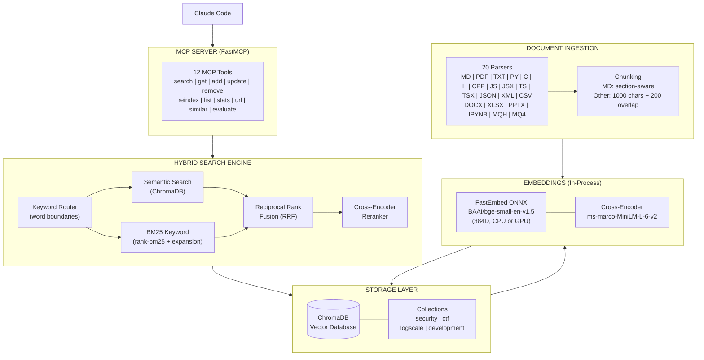
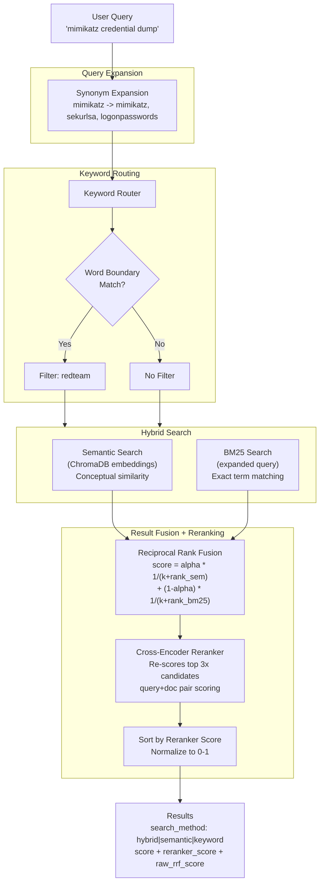
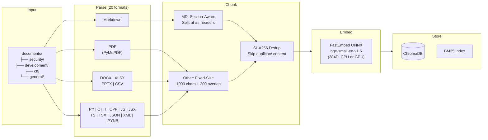
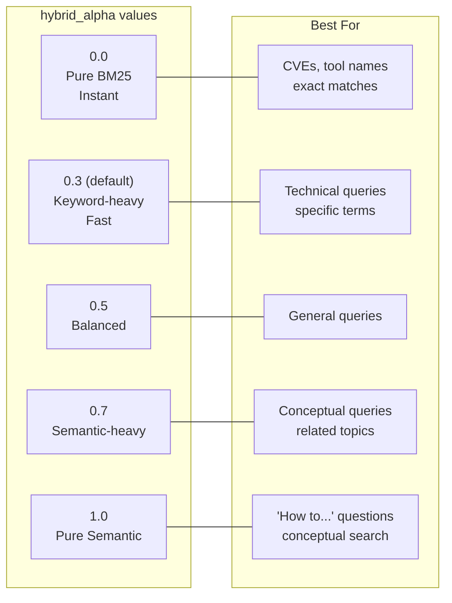

# Knowledge RAG

<div align="center">

[](https://pypi.org/project/knowledge-rag/)
[](https://www.npmjs.com/package/knowledge-rag)
[](https://pepy.tech/projects/knowledge-rag)


[](https://github.com/lyonzin/knowledge-rag/actions/workflows/ci.yml)
[](https://github.com/lyonzin/knowledge-rag/actions/workflows/security.yml)
[](https://glama.ai/mcp/servers/lyonzin/knowledge-rag)

### Your docs, your machine, zero cloud. Claude Code searches them natively.

Drop your PDFs, markdown, code, notebooks — **1800+ files, 39K chunks, indexed in under 3 minutes.**<br/>
Hybrid search (BM25 + semantic vectors + cross-encoder reranking) through 12 MCP tools.<br/>
Everything runs locally via ONNX. No Docker, no Ollama, no API keys, no data leaves your machine.

```
pip install knowledge-rag → restart Claude Code → search_knowledge("your query")
```

---

**12 MCP Tools** | **Hybrid Search + Reranking** | **20 File Formats** | **Optional NVIDIA GPU** | **100% Local**

[What's New](#whats-new-in-v360) | [Supported Formats](#supported-formats) | [Installation](#installation) | [Configuration](#configuration) | [API Reference](#api-reference) | [Architecture](#architecture)

</div>

---

## What's New in v3.6.0

### Multi-Language Code Parsing

Language-aware extraction for **C**, **C++**, **JavaScript**, **TypeScript**, and **XML** — functions, classes, structs, interfaces, imports, and namespaces are captured as searchable metadata. Total supported formats: **20**.

### 5 Ways to Install

```bash
npx -y knowledge-rag                    # NPM — zero setup, auto-manages Python venv
pip install knowledge-rag               # PyPI — classic Python install
curl -fsSL .../install.sh | bash        # One-line installer (Linux/macOS/Windows)
docker pull ghcr.io/lyonzin/knowledge-rag  # Docker — models pre-downloaded
git clone ... && pip install -r ...     # From source
```

All methods produce the same MCP server. See [Installation](#installation) for full instructions.

### Recent Highlights

- **v3.6.0** — Multi-language code parsing (C/C++/JS/TS/XML), NPM wrapper, Docker image, automated release pipeline
- **v3.5.2** — CUDA DLL auto-discovery from pip packages, graceful GPU→CPU fallback, explicit CPU provider (no CUDA noise when `gpu: false`), BASE_DIR resolution fix for editable installs
- **v3.5.1** — Remove Python `<3.13` upper bound — 3.13 and 3.14 now supported
- **v3.5.0** — Optional GPU acceleration, supported formats table, full README rewrite
- **v3.4.3** — MCP stdout save/restore fix (v3.4.2 broke JSON-RPC responses)
- **v3.4.0** — Persistent model cache, exclude patterns, Jupyter Notebook parser, inotify resilience, MetaTrader support

See [Changelog](#changelog) for full history.

---

## Supported Formats

| Format | Extension | Parser | Default | Notes |
|--------|-----------|--------|---------|-------|
| Markdown | `.md` | Section-aware (splits at `##`) | Yes | Headers preserved as chunk boundaries |
| Plain Text | `.txt` | Fixed-size chunking | Yes | 1000 chars + 200 overlap |
| PDF | `.pdf` | PyMuPDF extraction | Yes | Text-based PDFs only (no OCR) |
| Python | `.py` | Code-aware parser | Yes | Functions/classes as chunks |
| JSON | `.json` | Structure-aware | Yes | Flattened key-value extraction |
| CSV | `.csv` | Row-based parser | Yes | Headers + rows as text |
| Word | `.docx` | python-docx | Yes | Headings preserved as markdown |
| Excel | `.xlsx` | openpyxl | Yes | Sheet-by-sheet extraction |
| PowerPoint | `.pptx` | python-pptx | Yes | Slide-by-slide extraction |
| Jupyter Notebook | `.ipynb` | Cell-aware parser | Yes | Markdown + code cells only, no outputs/base64 |
| C Source | `.c` | Code-aware parser | Yes | Functions/structs/includes extracted |
| C/C++ Header | `.h` | Code-aware parser | Yes | Function declarations/structs extracted |
| C++ Source | `.cpp` | Code-aware parser | Yes | Classes/structs/includes extracted |
| JavaScript | `.js` | Code-aware parser | Yes | Functions/classes/imports (ESM + CJS) |
| React JSX | `.jsx` | Code-aware parser | Yes | Same as JS parser |
| TypeScript | `.ts` | Code-aware parser | Yes | Functions/classes/interfaces/enums/imports |
| React TSX | `.tsx` | Code-aware parser | Yes | Same as TS parser |
| XML | `.xml` | XML parser | Yes | Root element and namespace extraction |
| MQL4 Header | `.mqh` | Code parser | No | MetaTrader — add to `supported_formats` to enable |
| MQL4 Source | `.mq4` | Code parser | No | MetaTrader — add to `supported_formats` to enable |

> **Tip:** The parser dispatch is extensible. Any format mapped in `_parsers` can be enabled via `supported_formats` in config.yaml.

---

## Features

| Feature | Description |
|---------|-------------|
| **Hybrid Search** | Semantic + BM25 keyword search with Reciprocal Rank Fusion |
| **Cross-Encoder Reranker** | Xenova/ms-marco-MiniLM-L-6-v2 re-scores top candidates for precision |
| **GPU Acceleration** | Optional ONNX CUDA support for 5-10x faster indexing |
| **YAML Configuration** | Fully customizable via `config.yaml` with domain-specific presets |
| **Query Expansion** | Configurable synonym mappings (69 security-term defaults) |
| **Markdown-Aware Chunking** | `.md` files split by `##`/`###` sections instead of fixed windows |
| **In-Process Embeddings** | FastEmbed ONNX Runtime (BAAI/bge-small-en-v1.5, 384D) |
| **Keyword Routing** | Word-boundary aware routing for domain-specific queries |
| **20 Format Parsers** | MD, TXT, PDF, PY, C, H, CPP, JS, JSX, TS, TSX, JSON, XML, CSV, DOCX, XLSX, PPTX, IPYNB + opt-in MQH/MQ4 |
| **Category Organization** | Organize docs by folder, auto-tagged by path |
| **Incremental Indexing** | Change detection via mtime/size — only re-indexes modified files |
| **Chunk Deduplication** | SHA256 content hashing prevents duplicate chunks |
| **Query Cache** | LRU cache with 5-min TTL for instant repeat queries |
| **Document CRUD** | Add, update, remove documents via MCP tools |
| **URL Ingestion** | Fetch URLs, strip HTML, convert to markdown, index |
| **Similarity Search** | Find documents similar to a reference document |
| **Retrieval Evaluation** | Built-in MRR@5 and Recall@5 metrics |
| **File Watcher** | Auto-reindex on document changes via watchdog (5s debounce) |
| **Exclude Patterns** | Glob-based file/directory exclusion during indexing |
| **MMR Diversification** | Maximal Marginal Relevance reduces redundant results |
| **Persistent Model Cache** | Embedding models cached in `models_cache/` — survives reboots |
| **Auto-Migration** | Detects embedding dimension mismatch and rebuilds automatically |
| **12 MCP Tools** | Full CRUD + search + evaluation via Claude Code |

---

## Architecture

### System Overview



### Query Processing Flow



### Document Ingestion Flow



### hybrid_alpha Parameter Effect



---

## Installation

### Prerequisites

- Python 3.11+
- Claude Code CLI
- ~200MB disk for model cache (auto-downloaded on first run)
- *Optional:* NVIDIA GPU + CUDA for accelerated embeddings (`pip install knowledge-rag[gpu]` + `models.embedding.gpu: true` in config)

### Install Methods

Pick one — all produce the same running server.

#### Option A: NPX (fastest)

Requires Node.js 16+. Handles Python venv, pip install, and version upgrades automatically.

```bash
claude mcp add knowledge-rag -s user -- npx -y knowledge-rag
```

That's it. On first run, `npx` creates a venv at `~/.knowledge-rag/`, installs the PyPI package, and starts the MCP server. Subsequent runs reuse the cached venv.

#### Option B: One-line installer

```bash
# Linux/macOS:
curl -fsSL https://raw.githubusercontent.com/lyonzin/knowledge-rag/master/install.sh | bash

# Windows (PowerShell):
irm https://raw.githubusercontent.com/lyonzin/knowledge-rag/master/install.ps1 | iex
```

Then configure Claude Code:

```bash
claude mcp add knowledge-rag -s user -- ~/knowledge-rag/venv/bin/python -m mcp_server.server
```

> **Windows**: `claude mcp add knowledge-rag -s user -- %USERPROFILE%\knowledge-rag\venv\Scripts\python.exe -m mcp_server.server`

#### Option C: pip install

```bash
mkdir ~/knowledge-rag && cd ~/knowledge-rag
python3 -m venv venv && source venv/bin/activate
pip install knowledge-rag
knowledge-rag init              # Exports config template, presets, creates documents/
```

Then configure Claude Code:

```bash
claude mcp add knowledge-rag -s user -- ~/knowledge-rag/venv/bin/python -m mcp_server.server
```

> **Windows users**: Use `python` instead of `python3`, `venv\Scripts\activate` instead of `source venv/bin/activate`.
> **Windows path**: `claude mcp add knowledge-rag -s user -- %USERPROFILE%\knowledge-rag\venv\Scripts\python.exe -m mcp_server.server`

#### Option D: Clone from source

```bash
git clone https://github.com/lyonzin/knowledge-rag.git ~/knowledge-rag
cd ~/knowledge-rag
python3 -m venv venv && source venv/bin/activate
pip install -r requirements.txt
```

Then configure Claude Code:

```bash
claude mcp add knowledge-rag -s user -- ~/knowledge-rag/venv/bin/python -m mcp_server.server
```

#### Option E: Docker

```bash
docker pull ghcr.io/lyonzin/knowledge-rag:latest
```

```bash
claude mcp add knowledge-rag -s user -- \
  docker run -i --rm \
  -v ~/knowledge-rag/documents:/app/documents \
  -v ~/knowledge-rag/data:/app/data \
  ghcr.io/lyonzin/knowledge-rag:latest
```

Models are pre-downloaded in the image — no first-run delay.

<details>
<summary>Alternative: manual JSON config</summary>

Add to `~/.claude.json`:

**Windows:**
```json
{
  "mcpServers": {
    "knowledge-rag": {
      "command": "C:\\Users\\YOUR_USER\\knowledge-rag\\venv\\Scripts\\python.exe",
      "args": ["-m", "mcp_server.server"]
    }
  }
}
```

**Linux / macOS:**
```json
{
  "mcpServers": {
    "knowledge-rag": {
      "command": "/home/YOUR_USER/knowledge-rag/venv/bin/python",
      "args": ["-m", "mcp_server.server"]
    }
  }
}
```
> Replace `YOUR_USER` with your username, or use the full path from `echo $HOME`.
</details>

### Verify

```bash
claude mcp list
```

On first start, the server will:
1. Download the embedding model (~50MB, cached in `models_cache/`)
2. Auto-index any documents in the `documents/` directory
3. Start watching for file changes (auto-reindex)

---

## Usage

### Adding Documents

Place your documents in the `documents/` directory, organized by category:

```
documents/
├── security/          # Pentest, exploit, vulnerability docs
├── development/       # Code, APIs, frameworks
├── ctf/               # CTF writeups and methodology
├── logscale/          # LogScale/LQL documentation
└── general/           # Everything else
```

Or add documents programmatically via MCP tools:

```python
# Add from content
add_document(
    content="# My Document\n\nContent here...",
    filepath="security/my-technique.md",
    category="security"
)

# Add from URL
add_from_url(
    url="https://example.com/article",
    category="security",
    title="Custom Title"
)
```

### Searching

Claude uses the RAG system automatically when configured. You can also control search behavior:

```python
# Pure keyword search — instant, no embedding needed
search_knowledge("gtfobins suid", hybrid_alpha=0.0)

# Keyword-heavy (default) — fast, slight semantic boost
search_knowledge("mimikatz", hybrid_alpha=0.3)

# Balanced hybrid — both engines equally weighted
search_knowledge("SQL injection techniques", hybrid_alpha=0.5)

# Semantic-heavy — better for conceptual queries
search_knowledge("how to escalate privileges", hybrid_alpha=0.7)

# Pure semantic — embedding similarity only
search_knowledge("lateral movement strategies", hybrid_alpha=1.0)
```

### Indexing

Documents are automatically indexed on first startup. To manage the index:

```python
# Incremental: only re-index changed files (fast)
reindex_documents()

# Smart reindex: detect changes + rebuild BM25
reindex_documents(force=True)

# Nuclear rebuild: delete everything, re-embed all (use after model change)
reindex_documents(full_rebuild=True)
```

### Evaluating Retrieval Quality

```python
evaluate_retrieval(test_cases='[
    {"query": "sql injection", "expected_filepath": "security/sqli-guide.md"},
    {"query": "privilege escalation", "expected_filepath": "security/privesc.md"}
]')
# Returns: MRR@5, Recall@5, per-query results
```

---

## API Reference

### Search & Query

#### `search_knowledge`

Hybrid search combining semantic search + BM25 keyword search with cross-encoder reranking.

| Parameter | Type | Default | Description |
|-----------|------|---------|-------------|
| `query` | string | required | Search query text (1-3 keywords recommended) |
| `max_results` | int | 5 | Maximum results to return (1-20) |
| `category` | string | null | Filter by category |
| `hybrid_alpha` | float | 0.3 | Balance: 0.0 = keyword only, 1.0 = semantic only |

**Returns:**

```json
{
  "status": "success",
  "query": "mimikatz credential dump",
  "hybrid_alpha": 0.5,
  "result_count": 3,
  "cache_hit_rate": "0.0%",
  "results": [
    {
      "content": "Mimikatz can extract credentials from memory...",
      "source": "documents/security/credential-attacks.md",
      "filename": "credential-attacks.md",
      "category": "security",
      "score": 0.9823,
      "raw_rrf_score": 0.016393,
      "reranker_score": 0.987654,
      "semantic_rank": 2,
      "bm25_rank": 1,
      "search_method": "hybrid",
      "keywords": ["mimikatz", "credential", "lsass"],
      "routed_by": "redteam"
    }
  ]
}
```

**Search Method Values:**
- `hybrid`: Found by both semantic and BM25 search (highest confidence)
- `semantic`: Found only by semantic search
- `keyword`: Found only by BM25 keyword search

---

#### `get_document`

Retrieve the full content of a specific document.

| Parameter | Type | Description |
|-----------|------|-------------|
| `filepath` | string | Path to the document file |

**Returns:** JSON with document content, metadata, keywords, and chunk count.

---

#### `reindex_documents`

Index or reindex all documents in the knowledge base.

| Parameter | Type | Default | Description |
|-----------|------|---------|-------------|
| `force` | bool | false | Smart reindex: detects changes, rebuilds BM25. Fast. |
| `full_rebuild` | bool | false | Nuclear rebuild: deletes everything, re-embeds all documents. Use after model change. |

**Returns:** JSON with indexing statistics (indexed, updated, skipped, deleted, chunks_added, chunks_removed, dedup_skipped, elapsed_seconds).

---

#### `list_categories`

List all document categories with their document counts.

**Returns:**

```json
{
  "status": "success",
  "categories": {
    "security": 52,
    "development": 8,
    "ctf": 12,
    "general": 3
  },
  "total_documents": 75
}
```

---

#### `list_documents`

List all indexed documents, optionally filtered by category.

| Parameter | Type | Description |
|-----------|------|-------------|
| `category` | string | Optional category filter |

**Returns:** JSON array of documents with id, source, category, format, chunks, and keywords.

---

#### `get_index_stats`

Get statistics about the knowledge base index.

**Returns:**

```json
{
  "status": "success",
  "stats": {
    "total_documents": 75,
    "total_chunks": 9256,
    "unique_content_hashes": 9100,
    "categories": {"security": 52, "development": 8},
    "supported_formats": [".md", ".txt", ".pdf", ".py", ".json", ".docx", ".xlsx", ".pptx", ".csv", ".ipynb"],
    "embedding_model": "BAAI/bge-small-en-v1.5",
    "embedding_dim": 384,
    "reranker_model": "Xenova/ms-marco-MiniLM-L-6-v2",
    "chunk_size": 1000,
    "chunk_overlap": 200,
    "query_cache": {
      "size": 12,
      "max_size": 100,
      "ttl_seconds": 300,
      "hits": 45,
      "misses": 23,
      "hit_rate": "66.2%"
    }
  }
}
```

---

### Document Management

#### `add_document`

Add a new document to the knowledge base from raw content. Saves the file to the documents directory and indexes it immediately.

| Parameter | Type | Default | Description |
|-----------|------|---------|-------------|
| `content` | string | required | Full text content of the document |
| `filepath` | string | required | Relative path within documents dir (e.g., `security/new-technique.md`) |
| `category` | string | "general" | Document category |

---

#### `update_document`

Update an existing document. Removes old chunks from the index and re-indexes with new content.

| Parameter | Type | Description |
|-----------|------|-------------|
| `filepath` | string | Full path to the document file |
| `content` | string | New content for the document |

---

#### `remove_document`

Remove a document from the knowledge base index. Optionally deletes the file from disk.

| Parameter | Type | Default | Description |
|-----------|------|---------|-------------|
| `filepath` | string | required | Path to the document file |
| `delete_file` | bool | false | If true, also delete the file from disk |

---

#### `add_from_url`

Fetch content from a URL, strip HTML (scripts, styles, nav, footer, header), convert to markdown, and add to the knowledge base.

| Parameter | Type | Default | Description |
|-----------|------|---------|-------------|
| `url` | string | required | URL to fetch content from |
| `category` | string | "general" | Document category |
| `title` | string | null | Custom title (auto-detected from `<title>` tag if not provided) |

---

#### `search_similar`

Find documents similar to a given document using embedding similarity.

| Parameter | Type | Default | Description |
|-----------|------|---------|-------------|
| `filepath` | string | required | Path to the reference document |
| `max_results` | int | 5 | Number of similar documents to return (1-20) |

---

#### `evaluate_retrieval`

Evaluate retrieval quality with test queries. Useful for tuning `hybrid_alpha`, testing query expansion effectiveness, or validating after reindexing.

| Parameter | Type | Description |
|-----------|------|-------------|
| `test_cases` | string (JSON) | Array of test cases: `[{"query": "...", "expected_filepath": "..."}, ...]` |

**Metrics:**
- **MRR@5** (Mean Reciprocal Rank): Average of 1/rank for expected documents. 1.0 = always first result.
- **Recall@5**: Fraction of expected documents found in top 5 results. 1.0 = all found.

---

## Configuration

Knowledge RAG is fully configurable via a `config.yaml` file in the project root. If no `config.yaml` exists, sensible defaults are used — the system works out of the box with zero configuration.

### Quick Start

```bash
# Option 1: Use a preset
cp presets/cybersecurity.yaml config.yaml    # Offensive/defensive security, CTFs
cp presets/developer.yaml config.yaml        # Software engineering, APIs, DevOps
cp presets/research.yaml config.yaml         # Academic research, papers, studies
cp presets/general.yaml config.yaml          # Blank slate, pure semantic search

# Option 2: Start from the documented template
cp config.example.yaml config.yaml
# Edit config.yaml to your needs
```

Restart Claude Code after changing `config.yaml`.

### config.yaml Structure

```yaml
# Paths — where your documents live
paths:
  documents_dir: "./documents"    # Scanned recursively
  data_dir: "./data"              # Index storage
  models_cache_dir: "./models_cache"  # Persistent embedding model cache

# Documents — what gets indexed and how
documents:
  supported_formats:              # File types to index
    - .md
    - .txt
    - .pdf
    - .docx
    - .ipynb
    # - .py                       # Uncomment to index code
  exclude_patterns:               # Glob patterns to skip
    - "node_modules"
    - ".venv"
    - "__pycache__"
  chunking:
    chunk_size: 1000              # Max chars per chunk
    chunk_overlap: 200            # Shared chars between chunks

# Models — AI models for search (all run locally, no API keys)
models:
  embedding:
    model: "BAAI/bge-small-en-v1.5"   # ONNX, ~33MB, auto-downloaded
    dimensions: 384
    gpu: false                         # Set true + pip install knowledge-rag[gpu]
  reranker:
    enabled: true                      # Falls back to RRF if model is unavailable
    model: "Xenova/ms-marco-MiniLM-L-6-v2"
    top_k_multiplier: 3               # Candidates fetched before reranking

# Search — result limits and collection name
search:
  default_results: 5
  max_results: 20
  collection_name: "knowledge_base"   # Change for separate knowledge bases

# Categories — auto-tag documents by folder path
# Set to {} to disable categorization entirely
category_mappings:
  "security/redteam": "redteam"
  "security/blueteam": "blueteam"
  "notes": "notes"

# Keyword routing — prioritize categories based on query keywords
# Set to {} for pure semantic search with no routing bias
keyword_routes:
  redteam:
    - pentest
    - exploit
    - privilege escalation

# Query expansion — expand abbreviations for better BM25 recall
# Set to {} for no expansion (search terms used as-is)
query_expansions:
  sqli:
    - sql injection
    - sqli
  privesc:
    - privilege escalation
    - privesc
```

> See `config.example.yaml` for the fully documented template with explanations for every field.

### Presets

Pre-built configurations for common use cases:

| Preset | File | Categories | Keywords | Expansions | Best For |
|--------|------|-----------|----------|-----------|----------|
| **Cybersecurity** | `presets/cybersecurity.yaml` | 8 | 200+ | 69 | Red/Blue Team, CTFs, threat hunting, exploit dev |
| **Developer** | `presets/developer.yaml` | 9 | 150+ | 50+ | Full-stack dev, APIs, DevOps, cloud, databases |
| **Research** | `presets/research.yaml` | 9 | 100+ | 40+ | Academic papers, thesis, lab notebooks, datasets |
| **General** | `presets/general.yaml` | 0 | 0 | 0 | Blank slate — pure semantic search, no domain logic |

**Creating your own preset**: Copy `config.example.yaml`, fill in your categories/keywords/expansions, save to `presets/your-domain.yaml`.

### Configuration Reference

#### Paths

| Field | Default | Description |
|-------|---------|-------------|
| `paths.documents_dir` | `./documents` | Root folder scanned recursively for documents |
| `paths.data_dir` | `./data` | Internal storage for ChromaDB and index metadata |
| `paths.models_cache_dir` | `./models_cache` | Persistent cache for embedding models (~250MB). Survives reboots |

Relative paths resolve from the project root. Absolute paths work too.

#### Documents

| Field | Default | Description |
|-------|---------|-------------|
| `documents.supported_formats` | .md .txt .pdf .py .json .docx .xlsx .pptx .csv .ipynb | File extensions to index |
| `documents.exclude_patterns` | `[]` (empty) | Glob patterns for files/dirs to skip during indexing |
| `documents.chunking.chunk_size` | 1000 | Max characters per chunk |
| `documents.chunking.chunk_overlap` | 200 | Characters shared between consecutive chunks |

**Chunking guidelines**: Short notes → 500/100. General use → 1000/200. Long technical docs → 1500/300.

For `.md` files, chunking splits at `##` and `###` header boundaries first. Sections larger than `chunk_size` are sub-chunked with overlap. Non-markdown files use fixed-size chunking.

#### Models

| Field | Default | Description |
|-------|---------|-------------|
| `models.embedding.model` | `BAAI/bge-small-en-v1.5` | Embedding model (ONNX, runs locally) |
| `models.embedding.dimensions` | 384 | Vector dimensions (must match model) |
| `models.embedding.gpu` | false | Enable CUDA GPU acceleration. Requires `pip install knowledge-rag[gpu]` |
| `models.reranker.enabled` | true | Enable cross-encoder reranking |
| `models.reranker.model` | `Xenova/ms-marco-MiniLM-L-6-v2` | Reranker model |
| `models.reranker.top_k_multiplier` | 3 | Fetch N*multiplier candidates for reranking |

If the reranker model is not available locally and the machine cannot download it, search now falls back to the RRF order from hybrid semantic+BM25 retrieval. This keeps `search_knowledge` available offline, but result ordering may be less precise for ambiguous queries until the reranker model is cached.

**Embedding model options** (fastest → most accurate):
- `BAAI/bge-small-en-v1.5` — 384D, ~33MB (default)
- `BAAI/bge-base-en-v1.5` — 768D, ~130MB
- `BAAI/bge-large-en-v1.5` — 1024D, ~335MB
- `intfloat/multilingual-e5-small` — 384D, 100+ languages

> **Warning**: Changing the embedding model after indexing requires `reindex_documents(full_rebuild=True)`.

#### Search

| Field | Default | Description |
|-------|---------|-------------|
| `search.default_results` | 5 | Results returned when no limit specified |
| `search.max_results` | 20 | Hard cap even if client requests more |
| `search.collection_name` | `knowledge_base` | ChromaDB collection — change for separate KBs |

#### Categories

Map folder paths to category names. Documents in matching folders get auto-tagged, enabling filtered searches.

```yaml
category_mappings:
  "security/redteam": "redteam"
  "security": "security"
```

Set `category_mappings: {}` to disable — documents are still searchable, just without category filters.

#### Keyword Routing

Route queries to categories based on keywords. When a query contains listed keywords, results from that category are prioritized (not filtered — other categories still appear, ranked lower).

```yaml
keyword_routes:
  redteam:
    - pentest
    - exploit
    - sqli
```

Single-word keywords use regex word boundaries (`\b`) — "api" won't match "RAPID". Multi-word keywords use substring matching.

Set `keyword_routes: {}` for pure semantic search.

#### Query Expansion

Expand search terms with synonyms before BM25 search. Supports single tokens, bigrams, and full query matches.

```yaml
query_expansions:
  sqli:
    - sql injection
    - sqli
  k8s:
    - kubernetes
    - k8s
```

Set `query_expansions: {}` for no expansion.

### Hybrid Search Tuning

| hybrid_alpha | Behavior | Best For |
|--------------|----------|----------|
| 0.0 | Pure BM25 keyword | Exact terms, CVEs, tool names |
| 0.3 | Keyword-heavy **(default)** | Technical queries with specific terms |
| 0.5 | Balanced | General queries |
| 0.7 | Semantic-heavy | Conceptual queries, related topics |
| 1.0 | Pure semantic | "How to..." questions, abstract concepts |

---

## Project Structure

```
knowledge-rag/
├── mcp_server/
│   ├── __init__.py          # Stdout protection + version
│   ├── config.py            # YAML config loader + defaults
│   ├── ingestion.py         # 20 parsers, chunking, metadata extraction
│   └── server.py            # MCP server, ChromaDB, BM25, reranker, 12 tools
├── config.example.yaml      # Documented config template (copy to config.yaml)
├── config.yaml              # Your active configuration (git-ignored)
├── presets/                  # Ready-to-use domain configurations
│   ├── cybersecurity.yaml
│   ├── developer.yaml
│   ├── research.yaml
│   └── general.yaml
├── documents/               # Your documents (scanned recursively)
├── data/
│   ├── chroma_db/           # ChromaDB vector database
│   └── index_metadata.json  # Incremental indexing state
├── models_cache/            # Persistent embedding model cache
├── tests/                   # Test suite (82 tests)
├── install.sh               # Linux/macOS installer
├── install.ps1              # Windows installer
├── venv/                    # Python virtual environment
├── requirements.txt
├── pyproject.toml
├── LICENSE
└── README.md
```

---

## Troubleshooting

### Python version mismatch

Requires Python 3.11 or newer.

```bash
python --version    # Must be 3.11+
```

### FastEmbed model download fails

On first run, FastEmbed downloads models to `models_cache/`. If the download fails:

```bash
# Clear cache and retry
# Windows:
rmdir /s /q models_cache

# Linux/macOS:
rm -rf models_cache

# Then restart the MCP server
```

### Reranker model download fails

The reranker is lazy-loaded on the first query. If the model is not cached and the machine is offline, search continues without reranking and uses the RRF order from hybrid retrieval. To keep reranking enabled offline, run one query while online or pre-populate `models_cache/` on the target machine.

You can still disable reranking explicitly in `config.yaml`:

```yaml
models:
  reranker:
    enabled: false
```

Disabling reranking reduces memory use and avoids first-query model loading. The tradeoff is lower ranking precision, especially when several chunks match the same terms but only one is the best answer.

### ChromaDB index crashes on startup

Native ChromaDB failures can terminate Python before normal exception handling runs. Startup now probes ChromaDB in a child process before initializing the MCP server. If the probe crashes, the active `chroma_db/` and `index_metadata.json` are moved to `data/backups/auto-repair-*`, and the next startup can rebuild a clean index.

The same guarded behavior is available through either console script:

```bash
knowledge-rag
knowledge-rag-guarded
```

### Index is empty

```bash
# Check documents directory has files
ls documents/

# Force reindex via Claude Code:
# reindex_documents(force=True)

# Or nuclear rebuild if model changed:
# reindex_documents(full_rebuild=True)
```

### MCP server not loading

1. Check `~/.claude.json` exists and has valid JSON in the `mcpServers` section
2. Verify paths use double backslashes (`\\`) on Windows
3. Restart Claude Code completely
4. Run `claude mcp list` to check connection status

### "Failed to connect" error

The MCP server uses stdout for JSON-RPC communication. If a library prints to stdout during init, the stream gets corrupted. v3.4.3+ includes stdout protection that prevents this. If you're on an older version, upgrade:

```bash
pip install --upgrade knowledge-rag
```

### Slow first query

The cross-encoder reranker model is lazy-loaded on the first query. This adds a one-time ~2-3 second delay for model download and loading. Subsequent queries are fast. If the model cannot be loaded, search falls back to RRF ordering and does not retry loading the reranker until the server restarts.

### Memory usage

With ~200 documents, expect ~300-500MB RAM. The embedding model (~50MB) and reranker (~25MB) are loaded into memory. For very large knowledge bases (1000+ documents), consider enabling GPU acceleration and using exclude patterns to limit index scope.

---

## Changelog

### Unreleased

- **FIX**: Startup preflight probes ChromaDB in a child process and moves crashing persistent indexes to `data/backups/auto-repair-*` before MCP initialization.
- **FIX**: Reranker load failures now fall back to RRF ordering instead of failing `search_knowledge` on offline machines.
- **FIX**: Virtualenv project-root detection now handles Python symlinks that resolve to the system interpreter.
- **NEW**: `knowledge-rag-guarded` console script kept as an explicit guarded startup alias.

### v3.6.2 (2026-04-23)

- **INFRA**: NPM provenance attestation (SLSA supply chain security), full README on npm page
- **DOCS**: Reorganize Installation section — add NPX and Docker install methods, update What's New to v3.6.0

### v3.6.0 (2026-04-23)

- **NEW**: Multi-language code parsing — C (`.c`), C++ (`.cpp`/`.h`), JavaScript (`.js`/`.jsx`), TypeScript (`.ts`/`.tsx`) with per-language function/class/import extraction
- **NEW**: XML parser (`.xml`) — root element and namespace metadata extraction
- **NEW**: All 8 new formats default enabled — no config change needed
- **NEW**: NPM wrapper (`npx knowledge-rag`) + Docker image (`ghcr.io/lyonzin/knowledge-rag`)
- **NEW**: Automated release pipeline — PyPI (Trusted Publishing), NPM, Docker GHCR
- **IMPROVED**: Code parser reports correct `language` metadata per file type (was hardcoded to `"python"` for all code files)

### v3.5.2 (2026-04-16)

- **NEW**: Auto-discovery of CUDA 12 DLLs from pip-installed NVIDIA packages — no manual PATH configuration needed
- **NEW**: Graceful GPU→CPU fallback with `[WARN]` log when CUDA init fails (missing drivers, wrong version, etc.)
- **FIX**: Explicit `CPUExecutionProvider` when `gpu: false` — eliminates noisy CUDA probe errors in logs
- **FIX**: BASE_DIR resolution now correctly prefers directories with `config.yaml` over those with only `config.example.yaml` (fixes editable installs)

### v3.5.1 (2026-04-16)

- **FIX**: Removed Python upper bound constraint (`<3.13` → `>=3.11`). Python 3.13 and 3.14 now supported — onnxruntime ships wheels for both.

### v3.5.0 (2026-04-16)

- **NEW**: Optional GPU acceleration for ONNX embeddings — `pip install knowledge-rag[gpu]` + `models.embedding.gpu: true` in config. 5-10x faster indexing on NVIDIA GPUs with automatic CPU fallback.
- **DOCS**: Supported formats table added to README (20 formats)

### v3.4.3 (2026-04-16)

- **FIX**: Correct stdout protection via save/restore pattern — `__init__.py` saves original stdout and redirects to stderr during init, `server.py main()` restores it before `mcp.run()`. v3.4.2's global redirect broke MCP JSON-RPC response channel.

### v3.4.1 (2026-04-16)

- **FIX**: `pip install knowledge-rag` now auto-detects project directory from venv location
- **NEW**: `install.sh` — Linux/macOS installer with pip and from-source modes
- **IMPROVED**: BASE_DIR resolution chain: env var → source dir → venv parent → CWD → fallback

### v3.4.0 (2026-04-16)

- **NEW**: `models_cache_dir` — persistent embedding model cache, prevents re-download after reboots
- **NEW**: `exclude_patterns` — glob-based file/directory exclusion during indexing
- **NEW**: Jupyter Notebook (.ipynb) parser — extracts markdown and code cell sources only
- **NEW**: MCP stdout protection — redirects stdout to stderr before server start
- **NEW**: File watcher resilience — graceful fallback when Linux inotify limits are reached
- **NEW**: MetaTrader (.mq4, .mqh) support — opt-in code parsing
- **NEW**: 23 new tests (exclude patterns, ipynb parser, stdout protection)
- Community credit: [@Hohlas](https://github.com/Hohlas) ([PR #18](https://github.com/lyonzin/knowledge-rag/pull/18))

### v3.3.x

- **v3.3.2**: Full type validation on YAML config, bounds checking, version sync
- **v3.3.1**: YAML null value crash fix, presets bundled in pip wheel, `knowledge-rag init` CLI
- **v3.3.0**: YAML configuration system, 4 domain presets, generic use support

### v3.2.x

- **v3.2.4**: Symlink support with circular loop protection
- **v3.2.3**: BASE_DIR smart detection for pip installs
- **v3.2.2**: Plug-and-play pip install, `KNOWLEDGE_RAG_DIR` env var
- **v3.2.1**: Auto-recovery from corrupted ChromaDB
- **v3.2.0**: Parallel BM25 + Semantic search, adjacent chunk retrieval

### v3.1.x

- **v3.1.1**: Code block protection in markdown chunker, AAR category, 14 CVE aliases
- **v3.1.0**: DOCX/XLSX/PPTX/CSV support, file watcher, MMR diversification, PyPI publish

### v3.0.0 (2026-03-19)

- Replaced Ollama with FastEmbed (ONNX in-process)
- Cross-encoder reranking, markdown-aware chunking, query expansion
- 6 new MCP tools (12 total), auto-migration from v2.x

<details>
<summary>v2.x and earlier</summary>

- **v2.2.0**: `hybrid_alpha=0` skips Ollama, default changed from 0.5 to 0.3
- **v2.1.0**: Mermaid architecture diagrams
- **v2.0.0**: Hybrid search, RRF fusion, `hybrid_alpha` parameter
- **v1.1.0**: Incremental indexing, query cache, chunk deduplication
- **v1.0.1**: Auto-cleanup orphan folders, removed hardcoded paths
- **v1.0.0**: Initial release
</details>

---

## Contributing

1. Fork the repository
2. Create a feature branch (`git checkout -b feature/amazing-feature`)
3. Commit your changes
4. Push to the branch (`git push origin feature/amazing-feature`)
5. Open a Pull Request

---

## License

This project is licensed under the MIT License - see the [LICENSE](LICENSE) file for details.

---

## Acknowledgments

- [ChromaDB](https://www.trychroma.com/) — Vector database
- [FastEmbed](https://qdrant.github.io/fastembed/) — ONNX Runtime embeddings
- [FastMCP](https://github.com/anthropics/mcp) — Model Context Protocol framework
- [PyMuPDF](https://pymupdf.readthedocs.io/) — PDF parsing
- [rank-bm25](https://github.com/dorianbrown/rank_bm25) — BM25 Okapi implementation
- [Watchdog](https://github.com/gorakhargosh/watchdog) — File system monitoring
- [python-docx](https://python-docx.readthedocs.io/) / [openpyxl](https://openpyxl.readthedocs.io/) / [python-pptx](https://python-pptx.readthedocs.io/) — Office document parsing
- [PyYAML](https://pyyaml.org/) — YAML configuration parsing
- [Beautiful Soup](https://www.crummy.com/software/BeautifulSoup/) — HTML parsing for URL ingestion

---

## Author

**Lyon.**

Security Researcher | Developer

---

<div align="center">

**[Back to Top](#knowledge-rag)**

</div>
